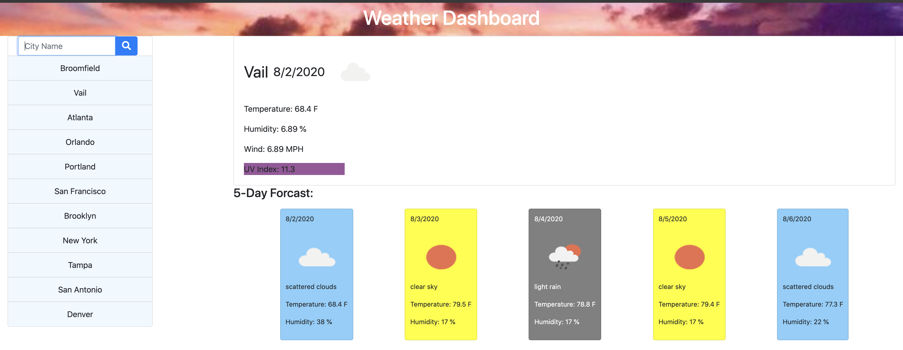

# WeatherDashboard

## Links:
Deployed Link
https://jttilley.github.io/WeatherDashboard/

## Tech Used:
Javascript, jQuery, Ajax, Open Weather API, moment.js

## Objective:
Search for and see live weather forecasts for different cities entered by the user. Store the city names in local storage.

## Screenshot:

## What I did:
* The user can enter a city name or city,state (with no spaces around the comma and the state needs to be a 2 letter state)
* The city is saved in local storage and added to a clickable list for quick access
* The current weather is displayed and under it the 5 day forcast
* The 5 day forcast is color coded based on the weather conditions
* The uv index is color coded based on how high. It is green, yellow, orange, red, purple from lowest to heighest.

## License
*MIT* © 2020 Jason Tilley